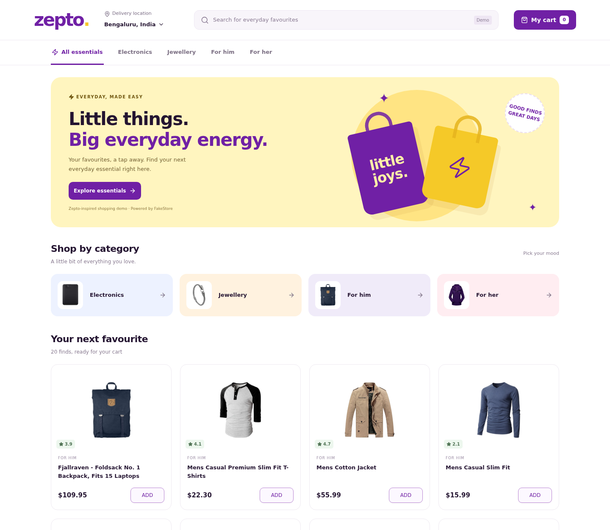
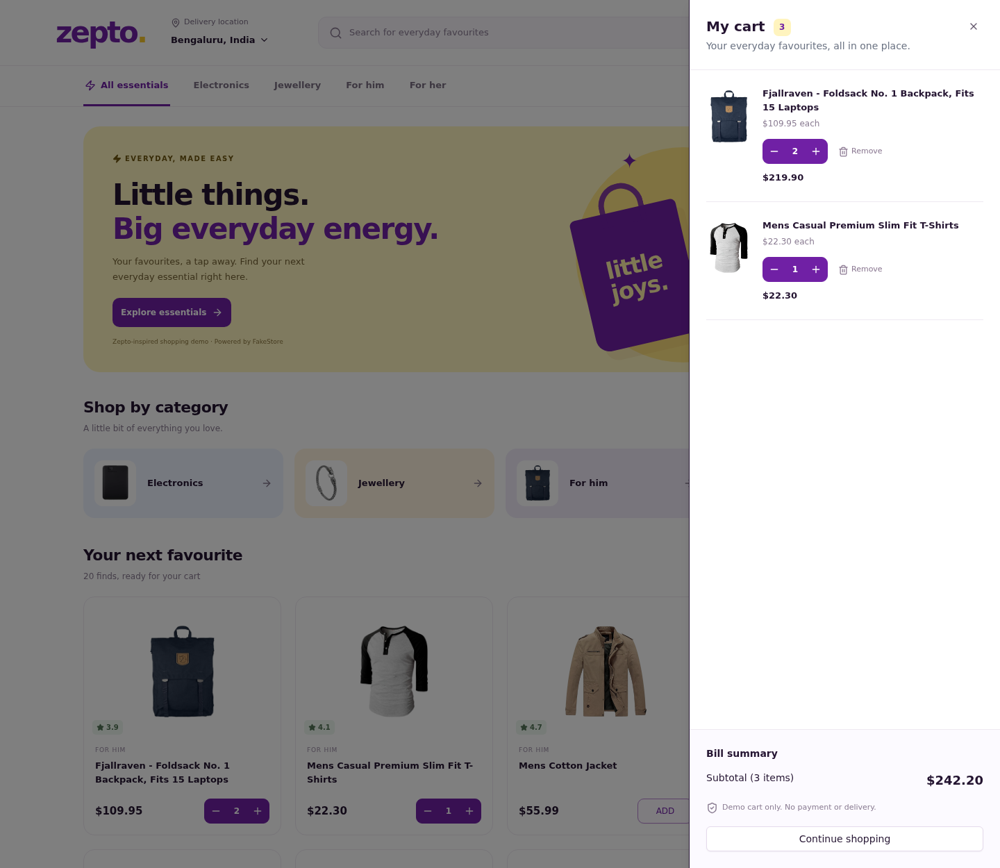
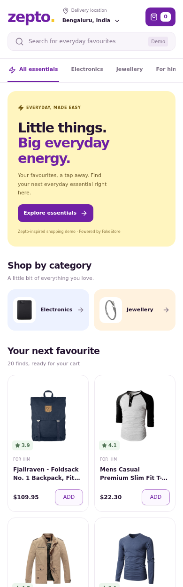
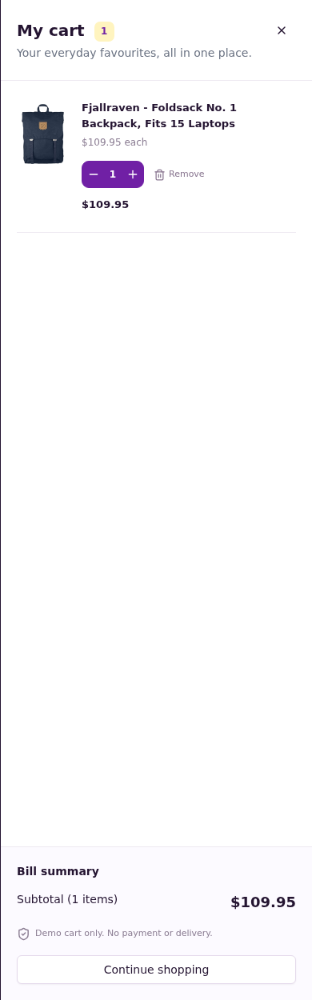

# Zepto home page clone

A responsive Zepto-inspired store built with React, TypeScript, Vite, Tailwind CSS, shadcn/ui, TanStack Query, and Zustand. Products and categories come from the real FakeStore API through native Fetch.

Educational demo, not affiliated with Zepto. FakeStore supplies clothing, jewellery and electronics rather than groceries. Prices are displayed in USD without an invented conversion.

## Setup

Use Node.js 22.12+ and npm. No API key or environment variables are needed.

```bash
npm ci
npm run dev
```

Open the local URL shown in your terminal, usually http://localhost:5173.

```bash
npm run build    # TypeScript check and production build
npm run preview  # Serve the production build
npm test         # Cart unit tests
```

Browser tests require an internet connection:

```bash
npx playwright install chromium
npm run test:e2e
```

Alternatively, set `CHROME_PATH` to an installed Chrome executable, for example `/usr/bin/google-chrome` on Linux.

## Features

- Logo, mock location selector, mock search display, live cart quantity badge.
- Horizontal category tabs fetched from the API.
- Scrollable category cards with images. Tabs and cards both filter products.
- Responsive product grid with image, title, rating, price and ADD button.
- ADD changes to quantity controls; repeated additions do not duplicate cart rows.
- Cart survives page reloads through Zustand persist and localStorage.
- Accessible shadcn Sheet with focus trap, Escape-to-close and overlay.
- Cart images, full titles, unit prices, increment/decrement, remove, line totals and subtotal.
- Empty state, loading skeletons, failed-request messages and retry buttons.
- Add/remove toasts, hover feedback, transitions and reduced-motion support.
- Two-column mobile, three-column tablet and four-column desktop grid.

## Why Zustand?

The cart has a small number of actions, so Zustand is easier to follow than Redux boilerplate for this assignment. The store centralises `addItem`, `decrement`, `removeItem` and `clearCart`. Components subscribe to only the state they need.

Only `items` is persisted under `zepto-cart-v1`, not action functions. Quantity zero removes an item. The badge counts all quantities, not only distinct products. Subtotal is calculated in integer cents to avoid floating-point errors.

## Data flow

1. `lib/api.ts` calls the API with native Fetch, passes the abort signal and checks HTTP status.
2. `useCatalog` uses separate TanStack Query keys for products and categories.
3. Products stay fresh for five minutes; categories for thirty minutes. Failed requests retry once. Retry buttons call `refetch()`.
4. `App` keeps the selected category and cart-open state locally.
5. Product cards and the cart Sheet share one Zustand store.

Products are fetched once and filtered locally. For this 20-item dataset this avoids extra requests on category changes. TanStack Query owns server data; Zustand owns cart state.

## Folder structure

```text
src/
  components/
    ui/                 # shadcn Button, Card and Sheet
    Header.tsx
    ProductCard.tsx
    QuantityControl.tsx
    CartSheet.tsx
  hooks/useCatalog.ts
  lib/api.ts
  lib/utils.ts
  store/cart.ts
  store/cart.test.ts
  types/product.ts
  App.tsx
  main.tsx
  index.css
tests/
  setup.ts              # In-memory storage for unit tests
  e2e/store.spec.ts      # Real-browser tests
```

The UI primitives are generated from shadcn/ui and customised for this design. The Sheet uses the full mobile width and a larger close target. Tailwind handles utilities and component styling; `index.css` holds the responsive brand layout.

## Verification

- Production build and TypeScript checks passed.
- Four cart unit tests passed: repeat additions, decrement-to-zero, removal and totals.
- Two browser tests passed against the live API.
- The browser loaded 20 products and four categories, tested tab/card filtering, add, increment, decrement, subtotal, reload persistence, remove and empty cart.
- Page overflow was checked at 320, 390, 768 and 1440 pixels.
- A simulated HTTP 503 displayed the error state; retry recovered through the live API.
- Desktop home, desktop cart, mobile home and mobile cart were captured and visually inspected.

Tests that call the live API can fail when FakeStore or the network is unavailable. The app does not silently replace API products with mock data.

## Screenshots

Real browser captures from the running app with live API data:

### Home



### Cart open



### Mobile home



### Mobile cart



## Scope and tradeoffs

- Search and location are mocks as requested. Location opens an explanatory demo message.
- No authentication, real payment, checkout or delivery promise.
- Category labels are Electronics, Jewellery, For him and For her. Filtering uses original API values.
- Cart persistence is browser-local, not account-based or synced across devices.
- FakeStore availability and image loading remain external dependencies.
- The design is Zepto-inspired, not a pixel-identical reproduction.

## Submission

This package has not been pushed to GitHub. Create a public repository in your own account and upload the extracted source folder, including `README.md`, lockfile and `docs/screenshots`. Do not include `node_modules`, `dist`, credentials or private files. You can also open the folder in your editor, initialise source control, commit, and publish it to your public repository.

## Interview walkthrough

Explain `useCatalog` first, then show the cart store. Describe immutable quantity updates and why the grid and Sheet stay in sync. Reload to demonstrate persistence. Filter a category and remove an item. Explain the loading/error states, responsive grid and the distinction between working cart functionality and the mocked search/location UI.
"# Androbuddy-task" 
